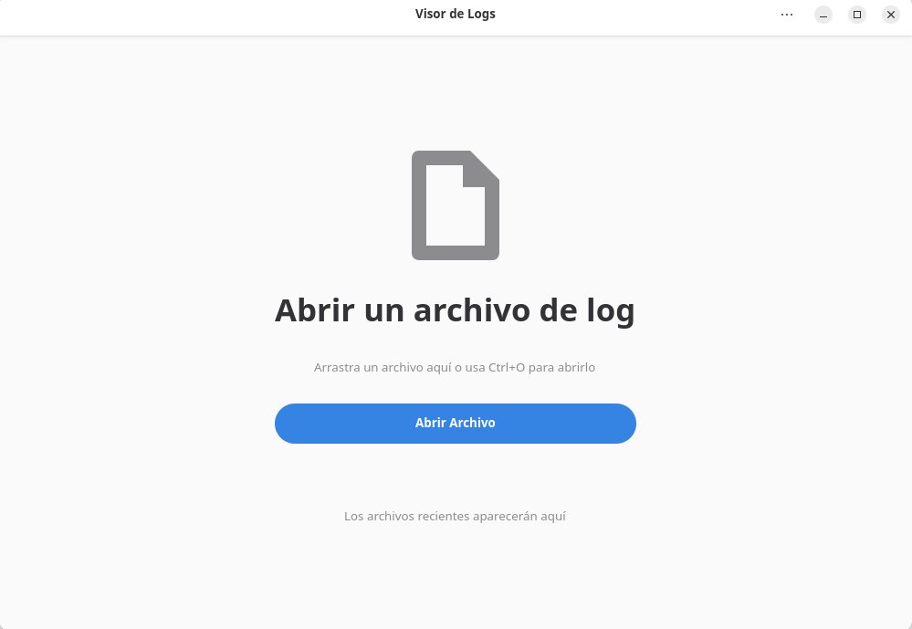
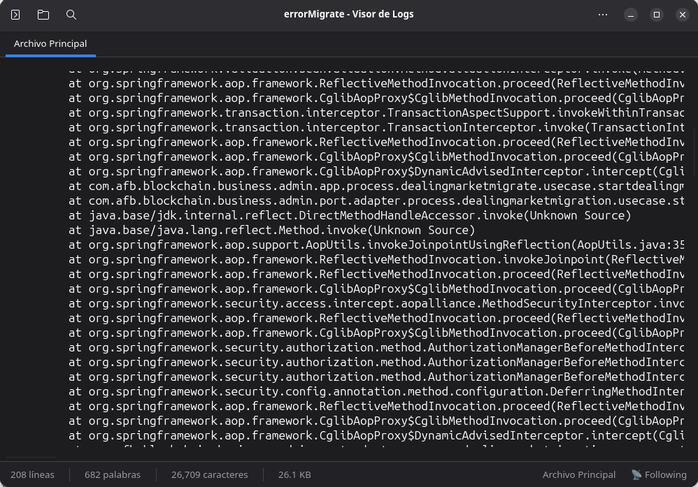
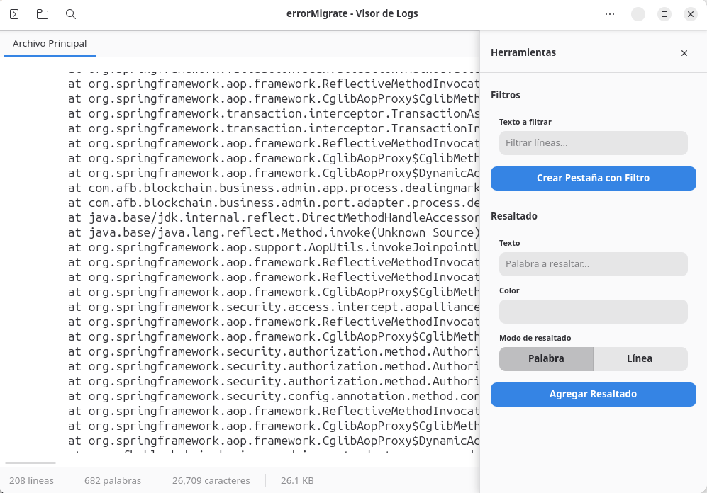

# Log Viewer

A modern, powerful, and user-friendly log file viewer built with Python and GTK4/Libadwaita, designed following GNOME Human Interface Guidelines.



## Features

### 🔍 **Powerful Viewing & Search**
- Open and view log files with syntax highlighting
- Real-time search with navigation between matches
- Search result counter and highlighting
- Monospace font display for proper log formatting

### 📡 **Real-time Monitoring**
- **Follow Logs**: Monitor files in real-time like `tail -f`
- Automatic scroll to bottom when new content arrives
- Handle file rotation and truncation
- Visual indicator when following is active

### 🎨 **Advanced Highlighting & Filtering**
- Create custom highlights with different colors
- Word-level or line-level highlighting modes
- Create filtered tabs showing only matching lines
- Multiple filter tabs with different criteria
- Per-tab highlight management

### 🖨️ **Professional Printing**
- Native print dialog integration
- Configurable font size and margins
- Print current tab or filtered content
- Professional document formatting

### 🌍 **Internationalization**
- Multi-language support (English, Spanish)
- Auto-detection of system language
- Easy to add new translations

### 🎨 **Modern Interface**
- GNOME/Libadwaita native design
- Dark and light theme support
- Responsive sidebar with tools
- Clean, distraction-free interface
- Keyboard shortcuts for all major functions

### ⚙️ **Customizable Experience**
- Persistent configuration settings
- Window size and position memory
- Theme and language preferences
- Printing defaults
- Follow logs setting

## Installation

### Prerequisites

Make sure you have the following dependencies installed:

```bash
# Ubuntu/Debian
sudo apt install python3 python3-gi python3-gi-cairo gir1.2-gtk-4.0 gir1.2-adw-1

# Fedora
sudo dnf install python3 python3-gobject gtk4-devel libadwaita-devel

# Arch Linux
sudo pacman -S python python-gobject gtk4 libadwaita
```

### From Source

1. Clone the repository:
```bash
git clone https://github.com/pabmartine/log-viewer.git
cd log-viewer
```

2. Make the script executable:
```bash
chmod +x log-viewer.py
```

3. Run the application:
```bash
./log-viewer.py
```

### System Installation (Optional)

To install system-wide:

```bash
# Copy the main script
sudo cp log-viewer.py /usr/local/bin/log-viewer

# Copy translations (if available)
sudo cp -r locale /usr/local/share/locale

# Make executable
sudo chmod +x /usr/local/bin/log-viewer
```

## Usage

### Basic Usage

1. **Open a file**: Click the "Open File" button or use `Ctrl+O`
2. **Search**: Press `Ctrl+F` to open the search bar
3. **Navigate**: Use the sidebar tools for filtering and highlighting

### Keyboard Shortcuts

| Shortcut | Action |
|----------|--------|
| `Ctrl+O` | Open file |
| `Ctrl+F` | Search |
| `Ctrl+P` | Print |
| `F9` | Toggle sidebar |
| `Escape` | Close search bar |

### Follow Logs (Real-time Monitoring)

1. Go to **Preferences** → **Monitoring**
2. Enable **"Follow Logs"**
3. Open a log file - it will automatically scroll to show new content
4. Perfect for monitoring active log files in real-time

### Filtering and Highlighting

1. **Open sidebar**: Press `F9` or click the sidebar button
2. **Create filters**: Enter text and click "Create Filter Tab"
3. **Add highlights**: Choose text, color, and mode, then click "Add Highlight"
4. **Manage**: Each tab has its own highlights and filters

## Configuration

The application stores its configuration in:
- Linux: `~/.config/log-viewer/config.json`

Settings include:
- Interface language
- Theme preference (dark/light)
- Window dimensions
- Follow logs setting
- Print defaults

## Development

### Project Structure

```
log-viewer/
├── log-viewer.py          # Main application
├── locale/                # Translations
│   ├── en/LC_MESSAGES/
│   └── es/LC_MESSAGES/
├── snapshots/             # Screenshots
│   ├── screenshot.png
│   ├── screenshot-dark.png
│   └── screenshot-sidebar.png
├── README.md
└── LICENSE
```

### Adding Translations

1. Create new `.po` files in `locale/[language]/LC_MESSAGES/`
2. Translate the strings
3. Compile with `msgfmt log-viewer.po -o log-viewer.mo`
4. Add language to the preferences menu

### Dependencies

- **Python 3.7+**
- **PyGObject** (GTK4 bindings)
- **GTK4** (>= 4.0)
- **Libadwaita** (>= 1.0)

## Screenshots

### Main Interface


### Dark Theme


### Sidebar Tools


## Contributing

Contributions are welcome! Please:

1. Fork the repository
2. Create a feature branch
3. Make your changes
4. Add/update translations if needed
5. Test on different systems
6. Submit a pull request

### Translation Contributors

- English: Log Viewer Team
- Spanish: Log Viewer Team

## License

This project is licensed under the GPL-3.0 License - see the [LICENSE](LICENSE) file for details.

## Changelog

### v1.0.0 (2025-01-31)
- Initial release
- Real-time log following (tail -f functionality)
- Advanced search and highlighting
- Multi-tab filtering
- Professional printing support
- Multi-language support (EN/ES)
- Modern GTK4/Libadwaita interface
- Comprehensive configuration system

## Support

If you encounter any issues or have suggestions:

1. Check existing [Issues](https://github.com/pabmartine/log-viewer/issues)
2. Create a new issue with detailed information
3. Include your system information and log files if relevant

## Acknowledgments

- Built with [GTK4](https://gtk.org/) and [Libadwaita](https://gitlab.gnome.org/GNOME/libadwaita)
- Follows [GNOME Human Interface Guidelines](https://developer.gnome.org/hig/)
- Inspired by modern text editors and log viewing tools

---

**Made with ❤️ for the GNOME ecosystem**